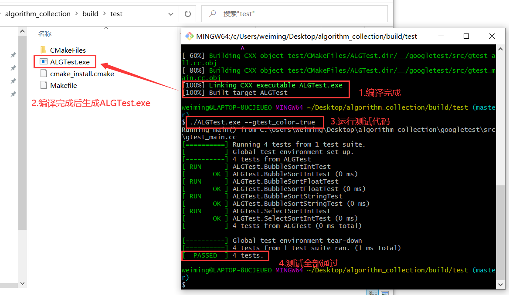

# 算法收集

## 简介

试着用c语言实现一些算法。
虽然在嵌入式中基本用不到这些算法，但我还是想做一条有梦想的咸鱼。

## 运行测试代码

### 运行环境

- ~~VSCode~~
- CMake
- MinGW
- Git

### 步骤

1. 用CMake打开根目录下的CMakeLists.txt。

2. 用CMake打开后，再按下图配置：

3. 此时我们可以看到根目录下多了一个build文件夹

4. 进入/build/test文件夹，按下图进行操作：

5. 编译完成后,运行测试代码

